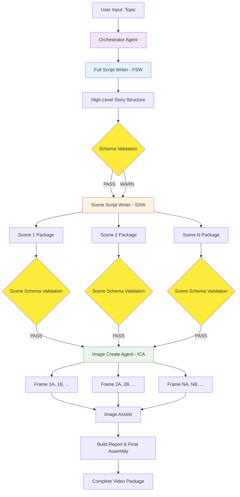
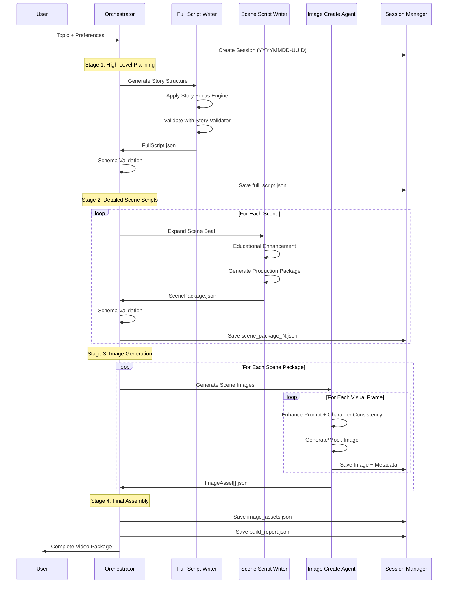
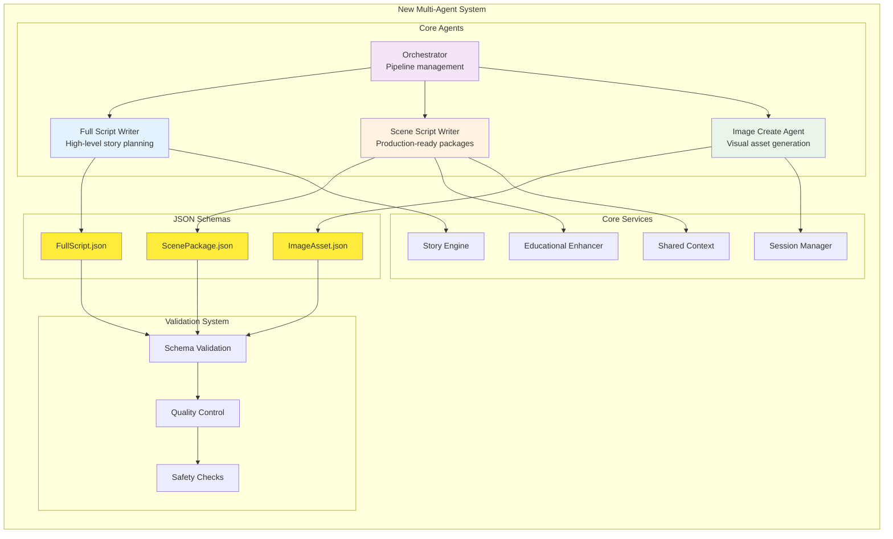
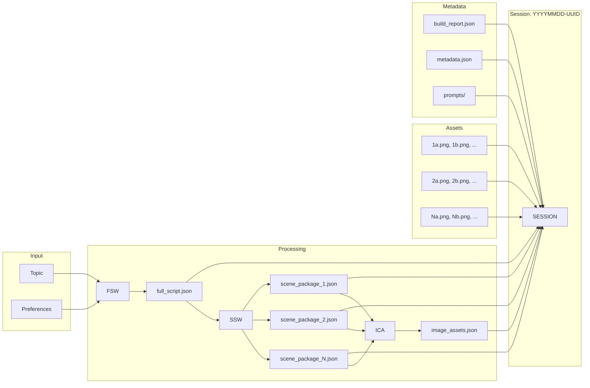

# New Multi-Agent Architecture Diagram

*Updated for the new production-ready architecture - September 16, 2025*

## 🎬 Complete Video Production Pipeline

## 🤖 Agent Interaction Flow

## 🏗️ New Architecture Components

## 📊 Data Flow & File Organization

## 🔄 Legacy vs New Architecture Comparison

| Aspect | Legacy Architecture | New Architecture |
|--------|-------------------|------------------|
| **Agent Count** | 5 agents (mixed roles) | 4 agents (clear separation) |
| **Data Flow** | Implicit, mixed | Explicit JSON contracts |
| **Validation** | Basic | Multi-layer (Schema + Semantic + Safety) |
| **Output Quality** | Variable | Production-ready |
| **Scene Detail** | Basic dialogue + simple prompts | Rich packages with timing, TTS, continuity |
| **Image Generation** | 1 image per scene | 3-8 frames per scene |
| **File Organization** | Basic script.json | Comprehensive session structure |
| **Debugging** | Limited logging | Full prompt/response tracking |
| **Extensibility** | Monolithic | Modular, schema-driven |
