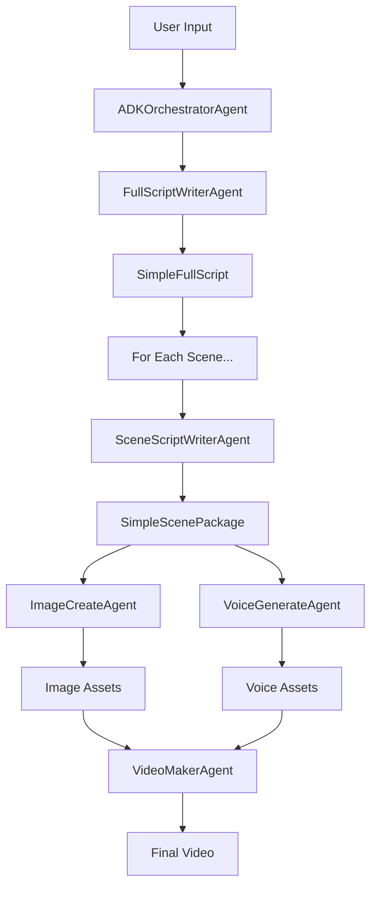

# ShortFactory System Architecture

**Simple, Pydantic-based Multi-Agent Video Production System**

---

## 🎯 System Overview

ShortFactory uses a **clean, simple architecture** based on:
- **LlmAgent + Pydantic Models** for structured AI interactions
- **Agent Pipeline** for video production workflow
- **Session Management** for output organization

### Core Philosophy
```
Agent + Input Model + Output Model = Complete Solution
Good Prompts > Complex Processing Logic
```

---

## 🤖 Agent Architecture

### 1. **FullScriptWriterAgent**
**Purpose**: Creates the high-level script structure with multiple scenes

**Input**: `FullScriptInput`
```python
{
    "topic": "Why are cats curious?",
    "length_preference": "60-90s", 
    "style_profile": "educational and engaging",
    "target_audience": "general",
    "language": "English",
    "knowledge_refs": ["optional references"]
}
```

**Output**: `SimpleFullScript`
```python
{
    "title": "The Curious Nature of Cats",
    "overall_style": "educational and engaging",
    "story_summary": "Educational exploration of feline curiosity...",
    "scenes": [
        {
            "scene_number": 1,
            "scene_type": "hook", 
            "title": "Why Do Cats Stare?",
            "beats": ["Introduce cat behavior", "Hook viewer attention"]
        },
        # ... more scenes
    ]
}
```

**Implementation**:
```python
self.agent = LlmAgent(
    model="gemini-2.5-flash",
    name="full_script_writer",
    instruction="You are a Full Script Writer Agent...",
    output_schema=SimpleFullScript,  # Direct Pydantic!
    output_key="full_script_result"
)
```

### 2. **SceneScriptWriterAgent** 
**Purpose**: Expands each scene into production-ready packages

**Input**: `SceneExpansionInput`
```python
{
    "scene_data": {
        "scene_number": 1,
        "scene_type": "hook",
        "title": "Why Do Cats Stare?",
        "beats": ["Introduce cat behavior", "Hook viewer"]
    },
    "global_context": {
        "main_character": "Glowbie",
        "overall_style": "educational and engaging",
        "target_audience": "general"
    },
    "previous_scenes": []  # For continuity
}
```

**Output**: `SimpleScenePackage`
```python
{
    "scene_number": 1,
    "narration_script": [
        {
            "line": "Have you ever noticed how cats stare intensely at seemingly nothing?",
            "at_ms": 0
        },
        {
            "line": "This mysterious behavior has fascinated humans for centuries.",
            "at_ms": 4000
        }
    ],
    "visuals": [
        {
            "frame_id": "1A",
            "shot_type": "medium",
            "image_prompt": "Glowbie character dressed as a cat researcher, pointing at a cat that's staring intently"
        }
    ],
    "tts": {
        "engine": "lemonfox",
        "voice": "sarah", 
        "speed": 1.0
    },
    "timing": {
        "total_ms": 8000,
        "estimated": true
    }
}
```

### 3. **ADKOrchestratorAgent**
**Purpose**: Manages the complete production pipeline

**Workflow**:
1. **Stage 1**: Full Script Generation
2. **Stage 2**: Scene-by-Scene Expansion
3. **Stage 3**: Validation & Quality Checks
4. **Stage 4**: Final Package Assembly

---

## 🔄 Agent Connection Flow



### Connection Details

#### 1. **Orchestrator → FullScriptWriter**
```python
# Create Pydantic input
full_script_input = FullScriptInput(
    topic=topic,
    length_preference=length_preference,
    style_profile=style_profile,
    target_audience=target_audience,
    language=language,
    knowledge_refs=knowledge_refs or []
)

# Type-safe call
full_script_output = await self.full_script_agent.generate_script(full_script_input)
```

#### 2. **Orchestrator → SceneScriptWriter** (For each scene)
```python
# Create Pydantic input for each scene
scene_input = SceneExpansionInput(
    scene_data=scene_data.model_dump(),
    global_context={
        "title": full_script_output.title,
        "overall_style": full_script_output.overall_style,
        "main_character": "Glowbie",
        "target_audience": target_audience
    },
    previous_scenes=[
        pkg.model_dump() for pkg in previous_scenes
    ]
)

# Type-safe call
scene_package = await self.scene_script_agent.expand_scene(scene_input)
```

#### 3. **Scene → Production Assets**
```python
# Each scene package contains everything needed for production:
for scene_package in scene_packages:
    # Generate images for each visual frame
    for visual in scene_package.visuals:
        image_asset = await image_agent.create_image(visual.image_prompt)
    
    # Generate voice for narration
    voice_asset = await voice_agent.generate_voice(scene_package.narration_script)
    
    # Combine into video segment
    video_segment = await video_agent.create_segment(images, voice, timing)
```

---

## 🎬 Video Production Pipeline

### Stage 1: Content Creation
1. **Script Structure**: FullScriptWriterAgent creates overall narrative
2. **Scene Details**: SceneScriptWriterAgent expands each scene
3. **Validation**: Check structure and content quality

### Stage 2: Asset Generation
1. **Image Generation**: 
   - Each `visual.image_prompt` → Image file
   - Character consistency (Glowbie integration)
   - Shot type consideration (wide, medium, close)

2. **Voice Generation**:
   - Each `narration_script.line` → Audio file
   - TTS settings applied (engine, voice, speed)
   - Timing synchronization (`at_ms` values)

### Stage 3: Video Assembly
1. **Timeline Construction**:
   - Audio track: Voice files with precise timing
   - Visual track: Images with duration based on narration
   - Transition effects: fade, cut, dissolve, slide

2. **Synchronization**:
   - `narration_script.at_ms` determines audio placement
   - `timing.total_ms` sets scene duration
   - Visual frames timed to match narration beats

3. **Final Rendering**:
   - Combine all assets into single MP4
   - Apply transitions between scenes
   - Generate final video metadata

---

## 📁 Data Flow & Storage

### Session Structure
```
sessions/YYYYMMDD-{session_id}/
├── full_script.json           # Complete script structure
├── scene_package_1.json       # Scene 1 details
├── scene_package_2.json       # Scene 2 details
├── scene_package_N.json       # Scene N details
├── images/                    # Generated image assets
│   ├── 1A.png                # Frame 1A image
│   ├── 1B.png                # Frame 1B image
│   └── ...
├── voices/                    # Generated voice assets
│   ├── scene_01_voice.mp3    # Scene 1 narration
│   ├── scene_02_voice.mp3    # Scene 2 narration
│   └── ...
├── videos/                    # Video segments
│   ├── scene_01.mp4          # Scene 1 video
│   ├── scene_02.mp4          # Scene 2 video
│   └── ...
├── final_video.mp4           # Complete assembled video
├── metadata.json             # Session metadata
└── build_report.json         # Production report
```

### Data Transformation Chain
```
User Topic
    ↓ (FullScriptInput)
Full Script Structure
    ↓ (SceneExpansionInput × N)
Scene Packages × N
    ↓ (Image Prompts)
Image Assets × M
    ↓ (Narration Scripts)
Voice Assets × N
    ↓ (Timeline Assembly)
Final Video
```

---

## 🔧 Technical Implementation

### LlmAgent Pattern
```python
# Every agent follows this exact pattern:
class SomeAgent:
    def __init__(self):
        self.agent = LlmAgent(
            model="gemini-2.5-flash",
            name="agent_name",
            instruction="Clear, specific instructions...",
            output_schema=PydanticModel,  # Direct model!
            output_key="result_key"
        )
        
        self.session_service = InMemorySessionService()
        self.runner = Runner(
            agent=self.agent,
            app_name="shortfactory", 
            session_service=self.session_service
        )
    
    async def process(self, input_data: PydanticInput) -> PydanticOutput:
        # Create session
        session = await self.session_service.create_session(...)
        
        # Create message
        message = types.Content(role='user', parts=[types.Part(text=prompt)])
        
        # Run through ADK
        events = self.runner.run(user_id="system", session_id=session.id, new_message=message)
        
        # Extract structured response
        for event in events:
            if event.is_final_response() and event.content:
                if self.output_key in session.state:
                    return session.state[self.output_key]  # Structured output
                elif event.content.parts:
                    return PydanticOutput.model_validate_json(event.content.parts[0].text)
        
        raise Exception("No response received")
```

### Error Handling & Fallbacks
Every agent has **robust fallback systems**:
- **Primary**: LlmAgent structured output
- **Secondary**: Manual JSON parsing from event content  
- **Tertiary**: Hardcoded fallback with valid Pydantic structure

### Type Safety
- **100% type safety** with Pydantic models
- **Compile-time error detection**
- **Automatic validation** at every step
- **Clean interfaces** between agents

---

## 🚀 Usage Examples

### Basic Usage
```bash
python main.py "Why do cats purr?"
```

### Cost-Saving Mode (Development)
```bash
python main.py "Artificial Intelligence" --cost
```

### Custom Parameters
```bash
python main.py "Climate Change" --length "2-3min" --style "serious and informative" --audience "students"
```

### Test Mode
```bash
python main.py --test --cost
```

---

## 📊 Performance & Monitoring

### Build Reports
Each session generates detailed reports:
- **Timing**: Per-stage execution times
- **Success Rates**: Agent success/fallback ratios
- **Validation Results**: Content quality metrics
- **API Usage**: Request counts and costs

### Session Management
- **Unique session IDs** for each video
- **Complete audit trail** of all inputs/outputs
- **Asset organization** for easy review
- **Metadata tracking** for analytics

---

## 🎯 Key Benefits

1. **Simplicity**: Clean agent interfaces, no over-engineering
2. **Type Safety**: Pydantic models prevent runtime errors
3. **Reliability**: Robust fallback systems ensure completion
4. **Maintainability**: Clear separation of concerns
5. **Scalability**: Easy to add new agents or modify existing ones
6. **Cost Efficiency**: Structured prompts minimize API usage

---

## 🔮 Future Extensions

Adding new agents is simple:
1. Define **Input/Output Pydantic models**
2. Create **LlmAgent with output_schema**
3. Add to **orchestrator pipeline**
4. Write **clear instructions**

No complex processing logic needed - just good prompts and clean data models!
