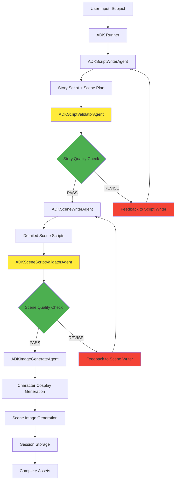
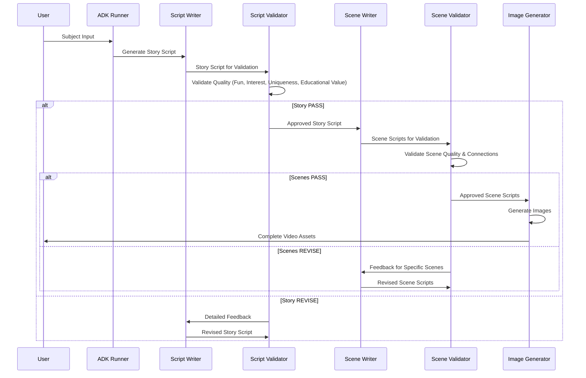
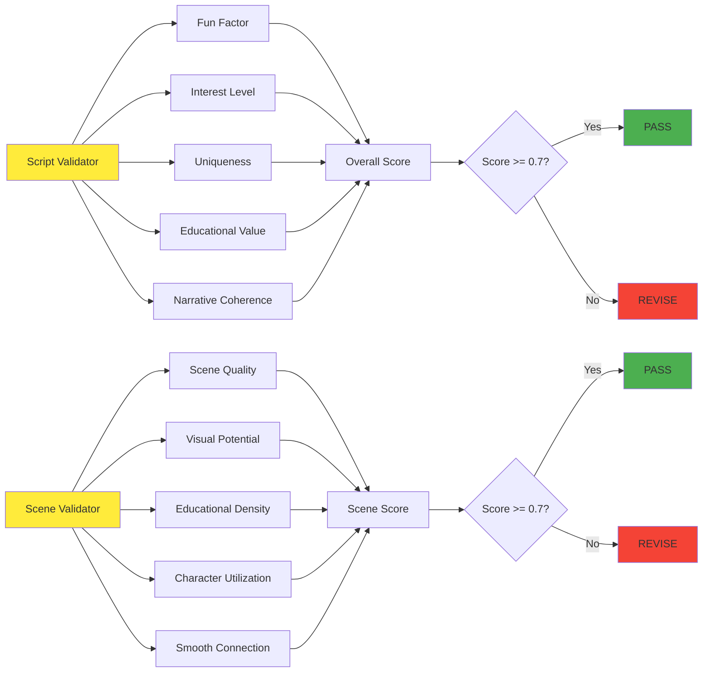
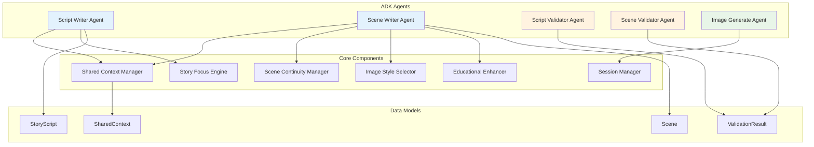

# Architecture Diagram

## 2-Stage Validation System Workflow

```mermaid
graph TD
    A[User Input: Subject] --> B[ADK Runner]
    B --> C[ADKScriptWriterAgent]
    C --> D[Story Script + Scene Plan]
    D --> E[ADKScriptValidatorAgent]
    
    E --> F{Story Quality Check}
    F -->|PASS| G[ADKSceneWriterAgent]
    F -->|REVISE| H[Feedback to Script Writer]
    H --> C
    
    G --> I[Detailed Scene Scripts]
    I --> J[ADKSceneScriptValidatorAgent]
    
    J --> K{Scene Quality Check}
    K -->|PASS| L[ADKImageGenerateAgent]
    K -->|REVISE| M[Feedback to Scene Writer]
    M --> G
    
    L --> N[Character Cosplay Generation]
    N --> O[Scene Image Generation]
    O --> P[Session Storage]
    P --> Q[Complete Assets]
    
    style E fill:#ffeb3b
    style J fill:#ffeb3b
    style F fill:#4caf50
    style K fill:#4caf50
    style H fill:#f44336
    style M fill:#f44336
```

## Agent Communication Flow

```mermaid
sequenceDiagram
    participant U as User
    participant R as ADK Runner
    participant SW as Script Writer
    participant SV as Script Validator
    participant SCW as Scene Writer
    participant SCV as Scene Validator
    participant IG as Image Generator
    
    U->>R: Subject Input
    R->>SW: Generate Story Script
    SW->>SV: Story Script for Validation
    SV->>SV: Validate Quality (Fun, Interest, Uniqueness, Educational Value)
    
    alt Story PASS
        SV->>SCW: Approved Story Script
        SCW->>SCV: Scene Scripts for Validation
        SCV->>SCV: Validate Scene Quality & Connections
        
        alt Scenes PASS
            SCV->>IG: Approved Scene Scripts
            IG->>IG: Generate Images
            IG->>U: Complete Video Assets
        else Scenes REVISE
            SCV->>SCW: Feedback for Specific Scenes
            SCW->>SCV: Revised Scene Scripts
        end
    else Story REVISE
        SV->>SW: Detailed Feedback
        SW->>SV: Revised Story Script
    end
```

## Validation Criteria System

```mermaid
graph LR
    A[Script Validator] --> B[Fun Factor]
    A --> C[Interest Level]
    A --> D[Uniqueness]
    A --> E[Educational Value]
    A --> F[Narrative Coherence]
    
    G[Scene Validator] --> H[Scene Quality]
    G --> I[Visual Potential]
    G --> J[Educational Density]
    G --> K[Character Utilization]
    G --> L[Smooth Connection]
    
    B --> M[Overall Score]
    C --> M
    D --> M
    E --> M
    F --> M
    
    H --> N[Scene Score]
    I --> N
    J --> N
    K --> N
    L --> N
    
    M --> O{Score >= 0.7?}
    N --> P{Score >= 0.7?}
    
    O -->|Yes| Q[PASS]
    O -->|No| R[REVISE]
    P -->|Yes| S[PASS]
    P -->|No| T[REVISE]
    
    style A fill:#ffeb3b
    style G fill:#ffeb3b
    style Q fill:#4caf50
    style S fill:#4caf50
    style R fill:#f44336
    style T fill:#f44336
```

## Core Components Architecture

```mermaid
graph TB
    subgraph "ADK Agents"
        A1[Script Writer Agent]
        A2[Scene Writer Agent]
        A3[Script Validator Agent]
        A4[Scene Validator Agent]
        A5[Image Generate Agent]
    end
    
    subgraph "Core Components"
        C1[Shared Context Manager]
        C2[Story Focus Engine]
        C3[Scene Continuity Manager]
        C4[Image Style Selector]
        C5[Educational Enhancer]
        C6[Session Manager]
    end
    
    subgraph "Data Models"
        D1[StoryScript]
        D2[Scene]
        D3[ValidationResult]
        D4[SharedContext]
    end
    
    A1 --> C1
    A1 --> C2
    A2 --> C1
    A2 --> C3
    A2 --> C4
    A2 --> C5
    A3 --> D3
    A4 --> D3
    A5 --> C6
    
    C1 --> D4
    A1 --> D1
    A2 --> D2
    
    style A1 fill:#e3f2fd
    style A2 fill:#e3f2fd
    style A3 fill:#fff3e0
    style A4 fill:#fff3e0
    style A5 fill:#e8f5e8
```
